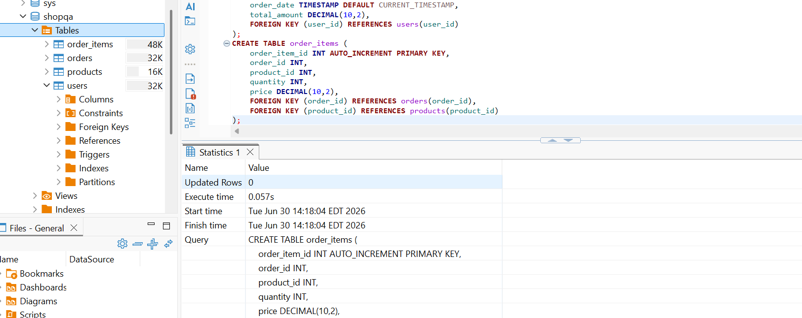
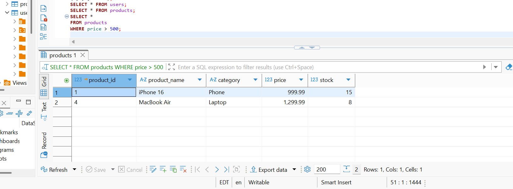
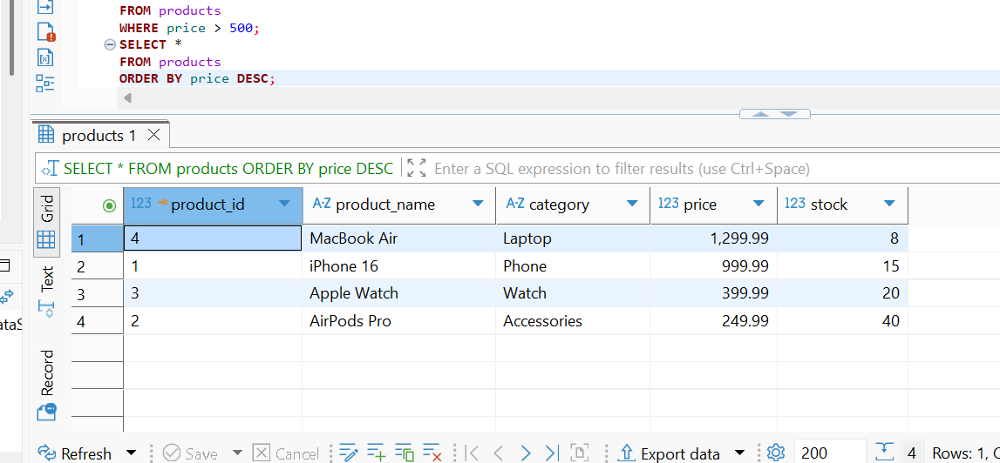
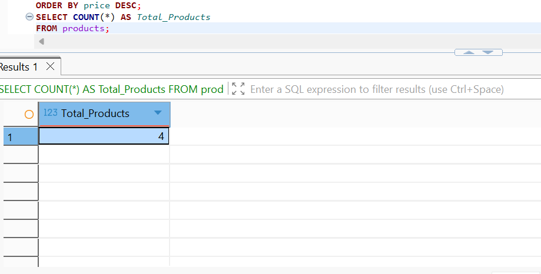

# 🗄️ ShopQA SQL Project

SQL database project demonstrating database design, data validation, and SQL querying skills commonly used by Manual QA Engineers and QA Analysts.

---

# 📋 Project Goal

The purpose of this project is to demonstrate SQL knowledge used in software testing for validating application data, verifying database relationships, and executing SQL queries.

This project covers:

- Database Design
- Table Relationships
- Test Data Validation
- SQL Query Execution
- Database Verification
- Result Validation

---

# 🗂️ Database Structure

The database consists of four related tables:

```
Users
Products
Orders
Order_Items
```

Relationships include:

- Primary Keys
- Foreign Keys
- One-to-Many Relationships

---

# 💻 SQL Skills Demonstrated

### Database Creation

- CREATE DATABASE
- CREATE TABLE

### Data Manipulation

- INSERT INTO

### Data Retrieval

- SELECT
- WHERE
- ORDER BY
- LIKE

### Aggregate Functions

- COUNT()
- AVG()

### Database Relationships

- INNER JOIN

---

# 🧪 QA Skills Demonstrated

- Database Testing
- SQL Validation
- Manual Testing
- Test Data Verification
- API Testing
- Bug Reporting

---

# 🛠️ Tools & Technologies

- MySQL
- DBeaver
- SQL
- Postman
- Jira
- Git
- GitHub

---

# 📂 Project Files

```
schema.sql
insert_data.sql
queries.sql
Screenshots/
README.md
```

---

# 📸 Sample Results

## Database Tables



---

## SELECT Query


---

## WHERE Clause



---

## ORDER BY



---

## COUNT()



---

## AVG()


---

## LIKE


---

## INNER JOIN


---

# 📈 Learning Outcomes

Through this project I practiced:

- Writing SQL queries
- Creating relational databases
- Validating application data
- Using JOINs to verify database relationships
- Executing aggregate queries
- Supporting Manual QA database validation

---

# 🔗 Related Projects

## ShopEase QA Portfolio

A complete Manual QA portfolio including:

- Test Plan
- Test Cases
- Bug Reports
- API Testing
- Smoke Testing
- Regression Testing
- SQL Validation

Repository:

https://github.com/afshanra1987-hash/ShopEase-QA-Portfolio

---

# 👩‍💻 Author

**Afshan Rajabi**

Manual QA Engineer

GitHub Portfolio
